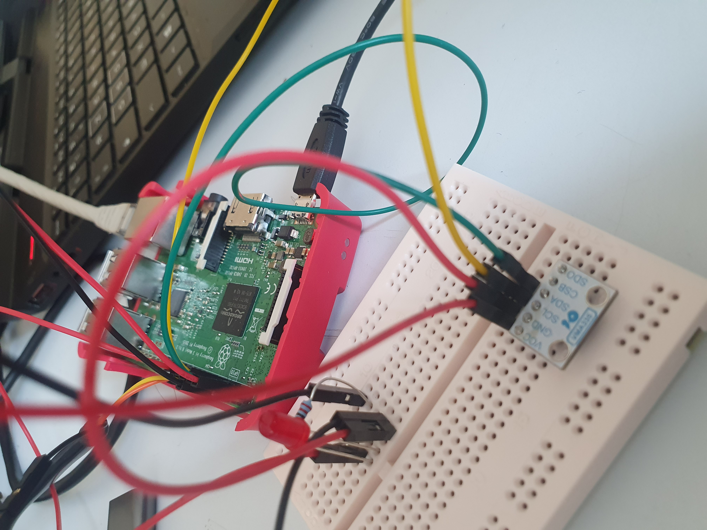

# RPI3

## Partie 6: I2C et BME280

* Question 1:

* Question 2:
 - Broche GND : Il s'agit de la masse du capteur
 - Broche VCC: Alimentation en 3V
 - Broche SDA: Broche permettant de recueillir les informations de température, pression, humidité...
 - Broche SCL: Broche pour l'horlogerie

* Question 3: Sur le bus i2c 1, on remarque qu'il y a l'adresse esclave 0x76 qui apparait. Il s'agit du capteur BME280:

  *0  1  2  3  4  5  6  7  8  9  a  b  c  d  e  f     
  00:          -- -- -- -- -- -- -- -- -- -- -- -- --  
  10: -- -- -- -- -- -- -- -- -- -- -- -- -- -- -- --  
  20: -- -- -- -- -- -- -- -- -- -- -- -- -- -- -- --  
  30: -- -- -- -- -- -- -- -- -- -- -- -- -- -- -- --  
  40: -- -- -- -- -- -- -- -- -- -- -- -- -- -- -- --  
  50: -- -- -- -- -- -- -- -- -- -- -- -- -- -- -- --  
  60: -- -- -- -- -- -- -- -- -- -- -- -- -- -- -- --  
  70: -- -- -- -- -- -- 76 --* 

* Question 4: 
	
	Il est normal qu'une adresse apparaisse, car la capteur est maintenant branché à la carte. Cependant, d'après la documentation, l'adresse 0x76 devrait apparaitre si on branche la broche SDO sur le pin GND, ce qui n'est pas notre cas ici.

* Question 5: 
  - 1ere étape :
  La première étape constiste demarrer le docker en effectuant les commandes suivantes:
    `sudo docker start "id of the docker"`
    `sudo docker attach "id of the docker"`
  
  - 2eme étape
  La deuxième étape quant à elle consiste à utiliser le cross-compilateur du docker afin de compiler les fichiers sources bme280.c et linux_userspace.c. Par a suite on obtiendra le binaire bme280. Les fichiers sources se trouvent dans le dossier BME280_driver, qui se trouve aussi dans le dossier buildroot-precompiled-2017.08. La commande suivante permet de compiler:
    `./../output/host/usr/bin/arm-linux-gcc bme 280.c linux_userspace.c -o bme280`
 
  
  - 3eme etape:
  La troisième étape est l'exécution du binaire dans la raspberry pi. La commande suivante permet son exécution: 
  `./bme280 /dev/i2c-1`
